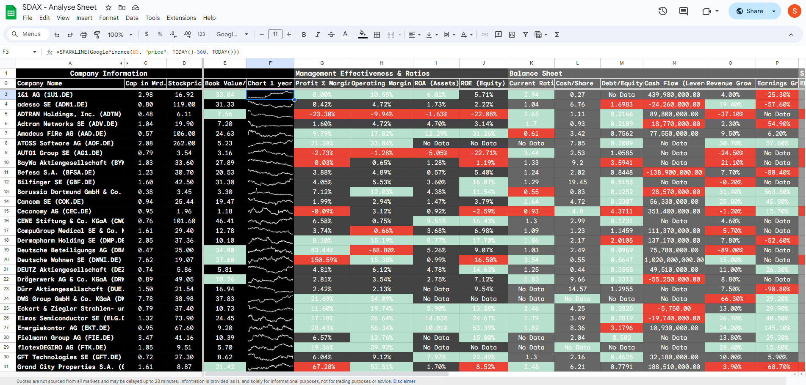

# SDAX_Aktienanalyse

This project Aims to enable a free Stock Analysis Sheet for the German SDAX Stock family with latest Data provided by Yahoo Finance. 

Due to high costs of Financial Data and Financial Data APIs it was necessary for me to implement a fully automated Stock Analysis Dashboard with no cost!

I use it myself for the first Step in the Stock Market Analysis Process.
Remember that a good Stock Pick needs further Research and Due Diligence after it got picked from the Dashboard! This is no financial Advise. The Project was created to demonstrate some Programming and IT Understanding Skills to future Employers.

## Skills and Tools i used for this Project
- Python Programming
- Webscraping with Beautiful Soup
- Web Requests and Knowledge about HTTP Requests
- Data Manipulation with Pandas
- Usage of Numpy for efficient Data operations
- Google Cloud Console
- API's (Google)
- Google Sheets Formulas (Advanced)
- Various Google Sheets Formatting

## Look at the Final Google Sheet Dashboard and the Data Dump Sheet

[SDAX_Stock_Analysis_Dashboard](https://docs.google.com/spreadsheets/d/133GuIO_aHu6SBelkRmA2gvcuh4TmS9st-rjIRDFON-k/edit#gid=0)

[SDAX Data Dump Sheet (only Data Store)](https://docs.google.com/spreadsheets/d/19yWEwyOEKP_sS_w2laKwD7uIcrST97LpABUaXEw8tQQ/edit#gid=0)



## Set up your Environment

Please make sure you have forked the repo and set up a new virtual environment. For this purpose you can use the following commands:

The added [requirements file](requirements.txt) contains all libraries and dependencies we need to execute the hands-on notebook.

*Note: If there are errors during environment setup, try removing the versions from the failing packages in the requirements file. M1 shizzle.*

### **`macOS`** type the following commands : 


- Install the virtual environment and the required packages by following commands:

    ```BASH
    pyenv local 3.11.3
    python -m venv .venv
    source .venv/bin/activate
    pip install --upgrade pip
    pip install -r requirements.txt
    ```
### **`WindowsOS`** type the following commands :

- Install the virtual environment and the required packages by following commands.

   For `PowerShell` CLI :

    ```PowerShell
    pyenv local 3.11.3
    python -m venv .venv
    .venv\Scripts\Activate.ps1
    pip install --upgrade pip
    pip install -r requirements.txt
    ```

    For `Git-bash` CLI :
  
    ```BASH
    pyenv local 3.11.3
    python -m venv .venv
    source .venv/Scripts/activate
    pip install --upgrade pip
    pip install -r requirements.txt
    ```
     **`Note:`**
    If you encounter an error when trying to run `pip install --upgrade pip`, try using the following command:

    ```Bash
    python.exe -m pip install --upgrade pip
    ```
